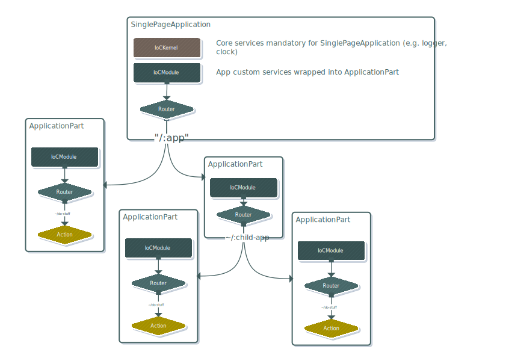

# @aster-js/app

```bash
npm install --save @aster-js/app
```

## Main concept

This library has the goal of helping organizing your application services and lifecycles by creating a hierarchy of `ApplicationPart` drived by `routes`.



## Gets started

To create a basic application, you need to create a new `SinglePageApplication`.

### The shortest way
```ts
const app = await SinglePageApplication.start("Library", (builder) => {
    builder.configure(services => services.addSingleton(MyService))
});
```

### The more detailled way
```ts
const builder = SinglePageApplication.create("Library");

builder.configure(services => services.addSingleton(MyService));

const app =  builder.build();
await.start();
```

### Declaring you first route handler
```ts
const builder = SinglePageApplication.create("Library");

builder.addAction("/my-action", _ => console.warn("Action called"));

const app =  builder.build();
await.start();
```
